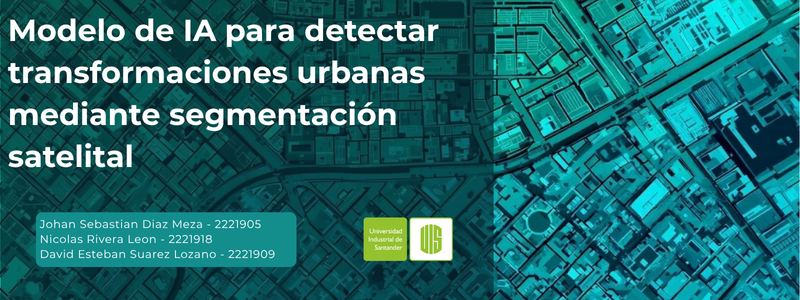

# Modelo de IA para detectar transformaciones urbanas mediante segmentacion satelital

## Autores
  * Johan Sebastian Diaz Mesa
  * David Esteban Suarez Lozano
  * Nicolás Rivera Leon

## Objetivo
Desarrollar e implementar un sistema automatizado basado en técnicas de deep learning que segmente de manera precisa zonas edificadas a partir de imágenes satelitales.

## Dataset
El dataset fue tomado de https://huggingface.co/datasets/blanchon/INRIA-Aerial-Image-Labeling

## Modelos Supervisados

  * GaussianNB
  * Decision Tree
  * Random Forest

## Modelos No Supervisados

